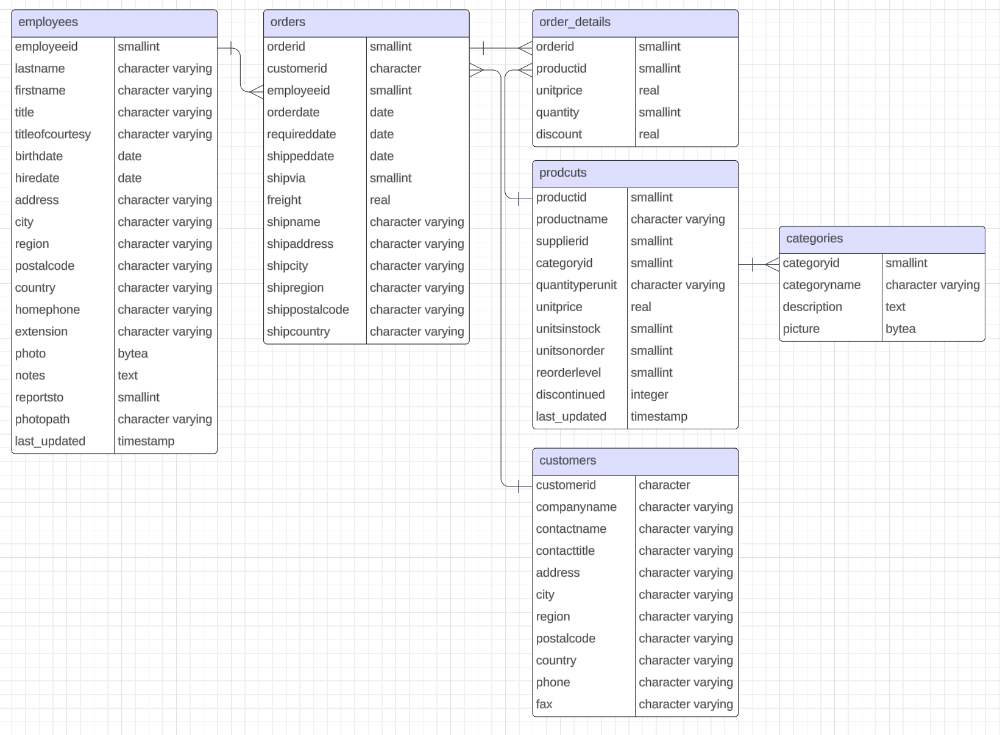
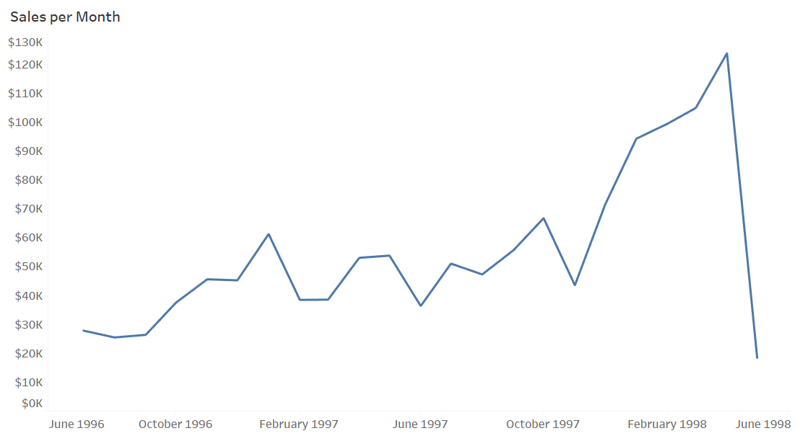
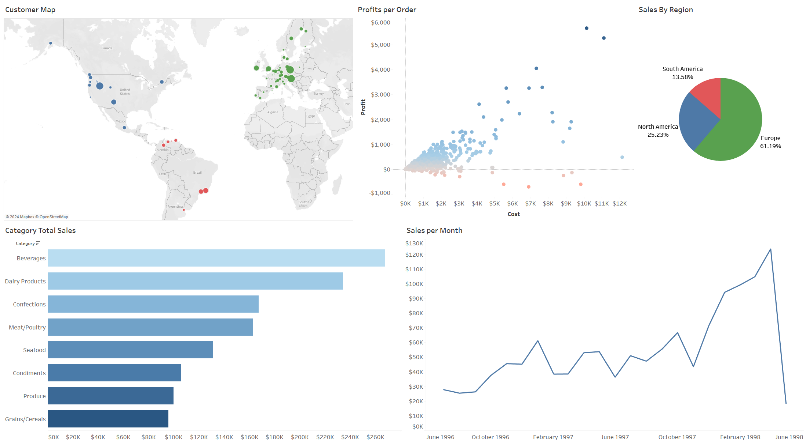
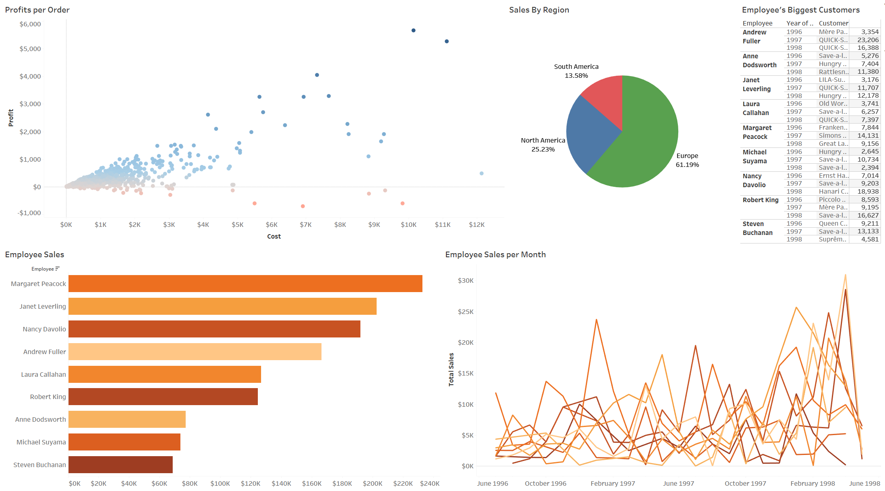

# Northwind Data Visualizations
## Project Background

Northwind Traders is a fictional company specializing in the import and export of specialty food products. This project analyzes its sales data to uncover key insights and provide recommendations for enhancing profitability.

Insights and recommendations are provided on the following key areas:

+ **Sales Trend Analysis:** An evaluation of sales patterns and order profitability by region and product category.
+ **Employee Performance:** An assessment of individual employee sales performance.

A file holding the queries used to create the tables used and to perform other analysis can be found [here.](northwind_queries.sql)  
The interactive Tableau dashboards can be accessed [here.](https://public.tableau.com/app/profile/giovanni.pecorino/viz/NorthwindDashboards/SalesBreakdown?publish=yes)

## About the Dataset

The Northwind database contains 17 tables, of which only six were relevant for this analysis: *customers, categories, employees, orders, order_details,* and *products*. Together, these tables contain a total of 3,170 records.

## Executive Summary

### Overview of Findings

Month-to-month sales remain relatively stable, typically alternating between months of higher and lower sales—likely due to customers ordering less in the month following larger purchases. This pattern held consistently until the last four months, which saw a substantial 181% increase in sales. With 92.8% of all orders generating positive profits and this recent sales surge, the company is performing well and showing strong growth potential. The following sections will explore the factors driving recent performance and identify opportunities for further improvement. 

Below is a screenshot from the Tableau dashboard, with additional examples provided throughout the report. The complete interactive dashboard can be accessed and downloaded [here.](https://public.tableau.com/app/profile/giovanni.pecorino/viz/NorthwindDashboards/SalesBreakdown?publish=yes)

## Insights

### Sales Trend Analysis

+ **Sales saw a dramatic 181.8% increase between November 1997 and April 1998.** Although there appears to be a sharp drop in May, this is due to April being the last month with complete data.
+ Sales follow a recurring peak-and-valley pattern, with an increase one month typically followed by a decrease the next. **Many customers alternate between high and low order volumes** rather than placing large orders consecutively.
+ The majority of sales come from **European customers, accounting for 61.1% of total sales.** The regional sales distribution has remained relatively consistent over the years.

### Employee Performance

## Recommendations

Based on the insights and findings above, the following recommendations have been provided:

## Assumptions and Caveats

Throughout the analysis, multiple assumptions were made to manage challenges with the data. These assumptions and caveats are noted below:

## Technologies

+ PostgreSQL: Used to create queries for the database
+ Tableau: Used to create visualizations and dashboards

